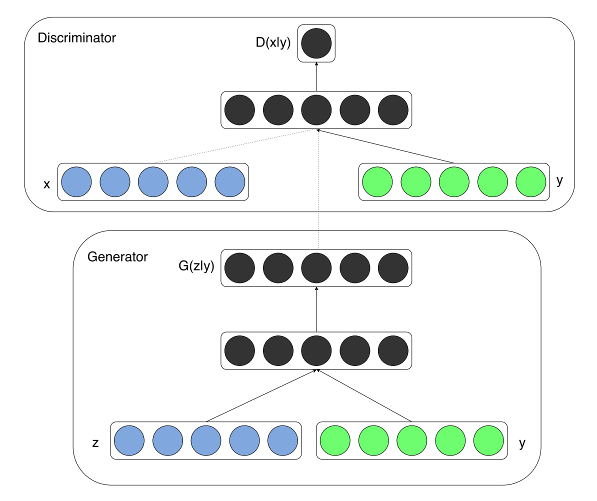
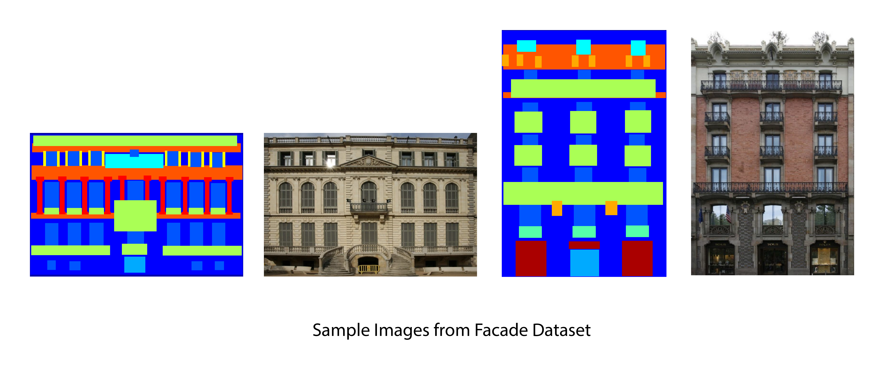

# Image-to-Image Translation with Conditional Adversarial Networks (pix2pix)
*Session notes for 4/18/18 DL session.*

[Paper](https://arxiv.org/pdf/1611.07004.pdf) | [Notebook](http://gluon.mxnet.io/chapter14_generative-adversarial-networks/pixel2pixel.html)

- GAN networks we have [seen so far](gan_training.md) cannot produce a particular output (a particular class or a transformation of a particular image). [Conditional GAN](https://arxiv.org/pdf/1411.1784.pdf) addresses this problem.

## Facade Dataset

